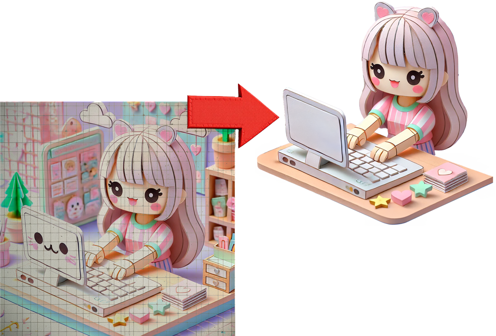

import useBaseUrl from '@docusaurus/useBaseUrl';
import CueCards from '@site/src/components/slides/CueCards';
import LigaHighlight from '@site/src/components/gsap/highlight'
import { FontAwesomeIcon } from '@fortawesome/react-fontawesome';
import { faPaperclip } from '@fortawesome/free-solid-svg-icons';
import IconToolsChatGPT from '@site/src/components/icons/IconToolsChatGPT'; //dentro do markdown estou usando o img para carregar este ícone -> inclui isso para mitigar o erro: aparece sem os masks no texto da página (ícone fica bugado) mas acerta depois de abrir o slide
import IconRetratarChatGPT from '@site/src/components/icons/IconRetratarChatGPT'; //dentro do markdown estou usando o img para carregar este ícone -> este não usa mask mas usei a mesma estratégia caso ele venha a dar algum outro problema no futuro
import ReactDOMServer from 'react-dom/server'
import '../apresentacao.css';
import myImage from '@site/static/img/docs/curso/estilo-kawaii.png';


# Imagens
<LigaHighlight />
export const paperClip =  ReactDOMServer.renderToString(<FontAwesomeIcon icon={faPaperclip} />);
export const toolsChatGPT = ReactDOMServer.renderToString(<IconToolsChatGPT />);
export const retratarChatGPT = ReactDOMServer.renderToString(<IconRetratarChatGPT />);
export const cardsData = [
  {
    title: "<i>Imagens</i>",
    description: "O ChatGPT possui a <i>habilidade</i> de <b>analisar</b> e <b>gerar</b> imagens ",
    backgroundColor: "rgb(77, 226, 132)"
  },
  {
    title: "ANÁLISE DE IMAGEM",
    description: "",
    backgroundColor:"rgba(47, 149, 227, 1)"
  },
  {
    title: "Gralhas?",
    description: "Como se livrar das <i>gralhas</i> usando o recurso de análise de imagens?</p>",
    backgroundColor: "#74b9ff"
  },
  {
    title: "Como fazer?",
    description: `<p>Anexar a imagem clicando no botão ${paperClip} e digitar o seu <i>prompt</i>.</p><p>Veja <a href="#promptImagem">este exemplo</a>.</p>`,
    backgroundColor:"rgba(47, 149, 227, 1)"
  },
  {
    title: "⚠️ Tipo de fonte!",
    description: "Teste se o ChatGPT reconhece as fontes tipográficas utilizadas pela sua organização, pois algumas podem não ser identificadas pela ferramenta."
    ,
    backgroundColor:"#ff7675"
  },
  {
    title: "GERAÇÃO DE IMAGEM",
    description: "",
    backgroundColor: "rgb(247, 180, 72)"
  },
  {
    title: "<i>Kawaii</i> (かわいい)",
    description: `Como direcionar o processo de geração de uma imagem?`,
    backgroundColor: "rgb(228, 215, 28)"
  },
  {
    title: "Estilo <i>Kawaii</i>",
    description: `Japonês &rarr; "fofo" ou "adorável"`,
    backgroundColor: "rgb(218, 228, 28)"
  },
  {
    title: "Como fazer?",
    description: `<p>Primeiro, clique em ${toolsChatGPT}, em seguida em ${retratarChatGPT}, e depois descreva a imagem desejada.</p><p>Veja <a href="#promptGerarImagem">este exemplo</a></p>`,
    backgroundColor: "rgb(247, 180, 72)"
  },
  {
    title: "⚠️ Dica!",
    description: "O processo de geração de imagens no ChatGPT ainda carece de precisão, envolvendo <b>tentativa e erro</b>. Após obter os <b>elementos principais</b>, recomendo finalizar o trabalho em uma <b>ferramenta de edição</b> de imagens.",
    backgroundColor: "#ff7675"
  },
];

<CueCards cardsData={cardsData} />

O ChatGPT tem a capacidade de analisar e gerar imagens, identificando pelo texto do *prompt* se a solicitação envolve esse recurso. Para garantir que o objetivo seja claro ao gerar uma imagem, selecione a opção <i>Ferramentas</i>  | <i>Retratar</i>  antes de enviar o comando.

## Analisar imagens
Um recurso interessante do ChatGPT é sua capacidade de identificar textos presentes em imagens. Esse recurso abre diversas possibilidades de uso. Vou dar um exemplo, mas antes: você sabe o que é uma "gralha"?

### Gralhas: O Que São?
Se você pensou em um pássaro, acertou! Porém, no contexto editorial, "gralha" se refere a erros tipográficos ou de digitação, como a falta de uma letra ou a inversão de caracteres. No passado, esses erros eram comuns em impressões manuais, quando letras eram organizadas de forma equivocada durante a composição dos textos. Hoje, tais falhas podem surgir durante a digitação, ao copiar e colar trechos entre documentos ou mesmo por descuidos na diagramação. O problema é que, devido à sua sutileza, esses erros podem passar despercebidos durante a revisão final do material.

### Solução?
Quando o conteúdo a ser revisado está em formato de texto, já mostrei [aqui como o ChatGPT pode ajudar](./revisao). Mas e quando o material final é um arquivo de imagem? É aí que entra a capacidade do ChatGPT de identificar textos presentes nas imagens.

<span id='promptImagem'></span>
Você pode enviar a imagem (botão <FontAwesomeIcon icon={faPaperclip} /> ) para o ChatGPT e solicitar uma revisão nos textos contidos nela. Veja este *prompt*:
```
Assuma o papel de um revisor experiente e revise os textos presentes na imagem anexada, priorizando os seguintes aspectos: ortografia correta, gramática precisa, pontuação adequada, uso adequado de conectivos e sintaxe correta.
```

:::warning
Fique atento, pois devido à grande variedade de tipos de fontes disponíveis, é possível que a fonte escolhida para a diagramação do texto não seja reconhecida pelo ChatGPT. Portanto, antes de colocar seu *prompt* em "produção", teste se o ChatGPT consegue identificar as fontes utilizadas pela sua organização.
:::

Seja nos impressos do século passado ou em posts para redes sociais, as "gralhas" continuam aparecendo. Felizmente, com ferramentas como o ChatGPT, é possível revisar textos em imagens e eliminar esses erros antes da publicação.

## Gerar imagens
Iniciei este texto mostrando o uso do ChatGPT para revisão de imagens, algo que considero bastante útil, mas que ainda é pouco explorado nas empresas. O uso mais popular, no entanto, é a geração de imagens. 

O pedido para a geração da imagem é feito por meio de um *prompt*, que pode variar em complexidade, desde instruções simples até detalhes mais elaborados, dependendo do nível de direcionamento que você deseja aplicar à criação.

Agora, você vai entender por que os textos deste curso são ilustrados com essas imagens "fofas". E lá vou eu aqui novamente... Antes de prosseguirmos, você sabe o que significa *kawaii*?


### *Kawaii*: O Que é?
*Kawaii* (かわいい) é uma palavra japonesa que significa "fofo" ou "adorável". Ela é usada para descrever qualquer coisa que seja charmosa, atraente e meiga, muitas vezes com um apelo infantil ou inocente. O conceito é amplamente difundido na cultura japonesa e influenciou várias áreas, como moda, design, entretenimento e comportamento social.
<span id='promptGerarImagem'></span>
Menciono o conceito de *kawaii* porque ele será útil para compreender um dos principais elementos no processo de direcionamento da geração de imagens: o estilo. Por meio do estilo, é possível orientar o resultado desejado com poucas palavras. Aqui estão dois exemplos de *prompts* que usei para criar imagens para este material:

```url link='https://chatgpt.com/share/677eed78-eb7c-8003-b2ed-451228551176'
Laptop feito de papel. 3D. Paper-toy. Kawaii.
```
```url link='https://chatgpt.com/share/677eed78-eb7c-8003-b2ed-451228551176'
Mulher digitando teclado notebook. 3D. Paper-toy. Kawaii.
```
Além de especificar os elementos principais da imagem — um laptop no primeiro caso e uma mulher no segundo —, a IA do gerador de imagens compreendeu que o estilo desejado deveria combinar a estética de paper toy (brinquedos de papel criados por meio de dobraduras) com a suavidade e a delicadeza do estilo *kawaii*, resultando em uma composição tridimensional.

Se você estiver atento ao que foi apresentado neste material,poderá notar que há diferenças entre o link que exibe o *prompt* e as imagens geradas e as versões que incluí aqui. O que fiz foi utilizar o resultado gerado pelo ChatGPT e editá-lo no Photoshop. Essa é minha dica valiosa para quem possui habilidade em edição de imagens.

<center>

</center>

Diferentemente dos exemplos de *prompts* para texto que apresentei anteriormente, o direcionamento para geração de imagens pelo ChatGPT ainda carece de precisão, sendo um processo que envolve muita tentativa e erro até alcançar o resultado desejado, o que pode consumir bastante tempo. Por isso, quando consigo os elementos principais da imagem que desejo, continuo o processo de refinamento no Photoshop ou mesmo no GIMP, uma ferramenta gratuita de edição de imagens.
