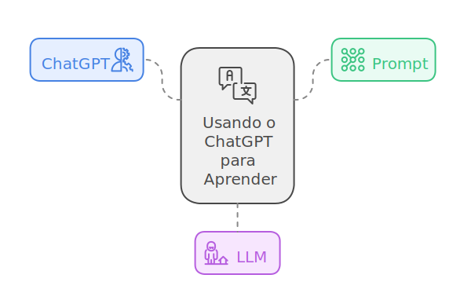

import IconExternalLink from '@theme/Icon/ExternalLink'
import IconCopy from '@theme/Icon/Copy'
import LigaHighlight from '@site/src/components/gsap/highlight'
import useBaseUrl from '@docusaurus/useBaseUrl';

# Vocabulário
<LigaHighlight />


Quando lidamos com novas tecnologias, <span class="text-highlight">é importante começar com definições básicas</span> que servem como o alicerce para o restante da jornada. No caso do ChatGPT, <span class="text-highlight">três termos são essenciais:</span> **ChatGPT**, ***Prompt*** e **LLM** (*Large Language Models*).

Em vez de simplesmente listar e explicar esses termos, farei algo diferente: <span class="text-highlight">vamos contar com a própria ferramenta</span> para nos auxiliar nas definições. Ao fazer perguntas, você aprenderá diretamente por meio da interação com o ChatGPT.

<center>

</center>

## Como utilizar o ChatGPT para aprender
A seguir, sugiro várias perguntas que você pode fazer ao ChatGPT. Escolha as que achar mais interessantes e experimente os resultados. Você pode usar o ícone <IconCopy style={{ width: '14', height: '14' }} /> para <span class="text-highlight">copiar a pergunta e colá-la diretamente no ChatGPT</span>, ou, se preferir, clicar no ícone <IconExternalLink /> para ver a resposta que obtive ao fazer essa pergunta. Basta passar o mouse sobre a pergunta ou clicar nela para visualizar estes ícones.

### *O que é ChatGPT?*
Vamos começar pedindo ao ChatGPT para se apresentar.
```url link='https://chatgpt.com/share/3de5759c-58fe-4395-bf6c-35e8ffc45ad9'
O que é ChatGPT?
```
<span class="text-highlight">Agora é a sua vez!</span> Experimente a pergunta acima e veja a resposta que o ChatGPT fornece. Como foi o resultado? Uma das vantagens de usar o ChatGPT para aprender é que, se a resposta não for clara ou não atender às suas necessidades, você pode <span class="text-highlight">ajustar a pergunta</span> para obter uma resposta mais personalizada. Por exemplo:

```url link='https://chatgpt.com/share/cf22a64e-8c44-4fde-8e40-e6f0a99af36b'
Sou leigo em inteligência artificial e gostaria de entender como o ChatGPT funciona.
```
Se a resposta ainda parecer técnica ou longa, podemos <span class="text-highlight">refinar</span> ainda mais:
```url wordWrap link='https://chatgpt.com/share/a86dc5d9-c14d-4c96-a38e-2190551b8ee3'
Sou leigo em inteligência artificial e tenho interesse em aprender como o ChatGPT funciona. Pode explicar de uma maneira que eu consiga entender, mesmo sem ter conhecimentos técnicos? Gostaria de uma explicação simples e concisa.
```
:::warning

Uma característica importante do ChatGPT é que ele pode gerar respostas diferentes para a mesma pergunta. Explicarei mais adiante neste guia por que isso ocorre. Portanto, mesmo que você faça a mesma pergunta que eu, pode obter uma resposta diferente da minha.

:::

### Explorando o conceito de Prompt
Agora que você já interagiu com o ChatGPT, vou falar sobre o próximo <span class="text-highlight">termo: *prompt*.</span> Para entender esse conceito, recomendo que você faça novas perguntas diretamente ao ChatGPT. Abaixo, sugiro algumas opções que você pode experimentar:

```url wordWrap link='https://chatgpt.com/share/5d8411f1-455a-4dd2-82b7-04f1c3064be6'
O que é um prompt?
```
Se desejar <span class="text-highlight">mais detalhes</span>,  pode tentar uma pergunta mais elaborada, como:
```url wordWrap link='https://chatgpt.com/share/a8d61274-27f7-4826-b1de-110d111e3efe'
Explique detalhadamente o que é um prompt no ChatGPT, usando linguagem simples e exemplos práticos para facilitar a compreensão de iniciantes.
```
Ou, para uma abordagem <span class="text-highlight">mais contextualizada:</span>
```url wordWrap link='https://chatgpt.com/share/60bb661c-d4ad-4e4e-b632-fe8154c1b676'
Você é um professor universitário de tecnologia explicando para uma turma de alunos iniciantes o que é um 'prompt' no ChatGPT. Sua tarefa é explicar de forma simples e didática, contextualizando como o ChatGPT usa o prompt para gerar respostas baseadas nas instruções fornecidas. Estruture a explicação em três parágrafos curtos e inclua um exemplo prático no final.
```
Agora que você já está familiarizado com o termo *prompt*, ele será utilizado com frequência ao longo do guia.

### O conceito de LLM
Para encerrar este capítulo introdutório, abordarei o último <span class="text-highlight">conceito essencial: LLM</span> (*Large Language Models*). Abaixo estão algumas sugestões de *prompts* para ajudar você a entender melhor esse termo:

```url wordWrap link='https://chatgpt.com/share/cb37f9ef-1977-4053-95e6-af9f562e7b27'
O que é um LLM?
```
Ou, se preferir uma explicação <span class="text-highlight">mais contextualizada</span>, você pode perguntar:
```url wordWrap link='https://chatgpt.com/share/103f0ce6-323d-4633-a79d-65c7cad00566'
Explique como o conceito de LLMs se relaciona com o ChatGPT.
```
Para facilitar o entendimento, também é possível <span class="text-highlight">pedir uma metáfora</span>, como:
```url wordWrap link='https://chatgpt.com/share/0f7e80d3-95be-4630-b44c-e17fa91c0a11'
Explique o conceito de LLM usando uma metáfora que facilite o entendimento para leigos.
```
E, se quiser uma explicação voltada a um <span class="text-highlight">público específico</span>, tente:
```url wordWrap link='https://chatgpt.com/share/541ec93b-24b2-45d5-b29c-89dc94421655'
Você é um pesquisador de IA explicando para uma equipe de líderes empresariais o que são Large Language Models. Sua tarefa é detalhar o funcionamento desses modelos, mencionando os avanços que possibilitaram seu desenvolvimento e suas aplicações no mundo corporativo. Estruture sua resposta em um formato de três parágrafos, cada um com foco em conceito, funcionamento e exemplos de uso prático.
```
:::danger[Uso Consciente]
O ChatGPT é uma ferramenta poderosa, mas seu uso indevido pode trazer consequências. Antes de utilizá-lo em atividades profissionais, consulte as políticas de sua organização, que muitas vezes possuem diretrizes específicas para ferramentas de inteligência artificial como o ChatGPT.
:::

Nesta seção, você descobriu <span class="text-highlight">como usar o próprio ChatGPT para explorar novos conceitos</span>, como Prompt e LLM. Essa abordagem prática e interativa é uma excelente forma de aprendizado, mas é importante lembrar que, às vezes, o ChatGPT pode cometer erros ou fornecer informações desatualizadas. 

<center>

</center>


