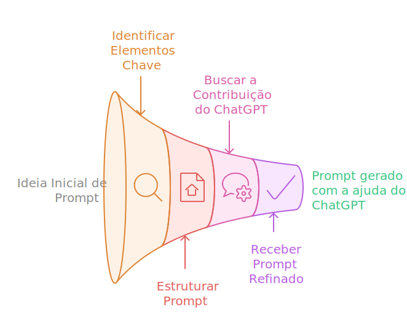

import IconExternalLink from '@theme/Icon/ExternalLink'
import LigaHighlight from '@site/src/components/gsap/highlight'
import useBaseUrl from '@docusaurus/useBaseUrl';
import './apresentacao.css';

# O Oráculo
<LigaHighlight />

 
Como vimos anteriormente, a chave para obter as melhores respostas do ChatGPT é aprender a formular boas perguntas, ou *prompts*. Pense no ChatGPT como um *chef* de cozinha: quanto mais detalhadas e específicas forem as suas instruções sobre o prato que você deseja, maior será a chance de ele preparar algo que atenda ao seu gosto. <span class="text-highlight">E tenho uma boa notícia:</span> você não precisa elaborar esses *prompts* sozinho. O ChatGPT pode ser um ótimo parceiro, ajudando você a melhorar suas perguntas com base nos parâmetros que ele já conhece.

## ChatGPT como auxiliar na construção de *prompts*
Se nos conteúdos anteriores pedimos ao ChatGPT para explicar conceitos como LLM e *prompt*, por que não contar com ele também para criar nossos próprios *prompts*? Pode parecer curioso à primeira vista, mas o ChatGPT pode oferecer orientações valiosas para ajudar você a estruturar suas perguntas de forma mais eficiente e precisa.

## O Oráculo moderno
Assim como os oráculos da antiguidade ajudavam a decifrar os mistérios da vida, o ChatGPT pode ser visto como um "oráculo digital", pronto para nos auxiliar a navegar pelos desafios e dúvidas do mundo contemporâneo. Com prática e paciência, você pode transformar suas interações com esse "oráculo virtual" em uma fonte rica de inspiração, conhecimento e soluções criativas.

Então, se tiver dúvidas sobre como formular o próximo *prompt*, peça ajuda ao próprio ChatGPT. Ele pode refinar suas perguntas, tornando-as mais claras, eficazes e detalhadas.

## Como o ChatGPT pode ajudar
Suponha que você queira entender os riscos de usar o ChatGPT, mas não sabe como estruturar a pergunta. Abaixo, apresento um exemplo de *prompt* que você poderia utilizar. Ele demonstra como é possível pedir ao ChatGPT para criar um *prompt* personalizado, incorporando os principais elementos que mencionei como dicas para um bom *prompt*: **Persona**, **Tarefa**, **Contexto** e **Formato**."

```url wordWrap link='https://chatgpt.com/share/c59614b7-ac88-4fb0-82c6-5fd386a2f8c4'
Utilizando seu conhecimento sobre a criação de prompts eficazes, elabore um prompt que pergunte ao ChatGPT sobre os riscos associados ao seu uso. O prompt deve incluir persona, tarefa, contexto e formato.
```
<details>
  <summary>Clique aqui para ver a resposta do ChatGPT.</summary>

**Persona**: Você é um especialista em ética de inteligência artificial que está avaliando o uso do ChatGPT em ambientes corporativos.

**Tarefa**: Você precisa entender os riscos associados ao uso do ChatGPT, incluindo aspectos éticos, de privacidade, e possíveis impactos negativos na produtividade e na qualidade das decisões empresariais.

**Contexto**: Sua empresa está considerando implementar o ChatGPT como uma ferramenta de apoio para comunicação interna, atendimento ao cliente, e suporte na tomada de decisões. Antes de seguir adiante, é essencial compreender os potenciais riscos e desafios que essa tecnologia pode apresentar.

**Formato**: Resposta detalhada, estruturada em seções que abordem os diferentes tipos de riscos (éticos, de privacidade, de viés, etc.), incluindo exemplos concretos e sugestões de mitigação.

---

**Prompt Final:**

"Sou um especialista em ética de inteligência artificial avaliando o uso do ChatGPT em ambientes corporativos. Minha empresa está considerando implementar essa tecnologia para comunicação interna, atendimento ao cliente, e suporte na tomada de decisões. Quais são os riscos associados ao uso do ChatGPT, incluindo aspectos éticos, de privacidade, viés e possíveis impactos na produtividade e qualidade das decisões empresariais? Por favor, forneça uma resposta detalhada, estruturada em seções que abordem cada tipo de risco, com exemplos concretos e sugestões de mitigação."
</details>

**O que achou da resposta?**  
Lembre-se de que comparei o ChatGPT a um **oráculo**, não a um **adivinho** 😉. O *prompt* acima pode não gerar exatamente o texto que você precisa, mas é um excelente ponto de partida. Aproveite a estrutura e as ideias, refinando o seu *prompt* até que ele atenda completamente às suas necessidades.

<center>

</center>

Se, mesmo com o exemplo gerado pelo ChatGPT, você ainda não se sentir confortável em elaborar um *prompt* completo, minha dica é usar uma abordagem mais direta. O *prompt* pode não ter as nuances de um texto mais elaborado, mas ainda assim costuma ser bastante efetivo. A pergunta pode apresentar cada elemento de forma clara e separada, especificando exatamente o que você deseja em termos de persona, tarefa, contexto e formato. Veja isso em ação no exemplo abaixo:

```url wordWrap link='https://chatgpt.com/share/c01d6e87-b6cc-4d4f-9399-8299e130975d'
Siga as instruções abaixo para responder:
Persona: Professor experiente e didático, com profundos conhecimentos sobre o funcionamento do ChatGPT.
Tarefa: Explicar os riscos associados ao uso do ChatGPT.
Contexto: Aula sobre como usar o ChatGPT de forma eficaz.
Formato: Lista explicando os riscos. Para cada item, inclua uma metáfora simples.
```

Essa abordagem não só facilita a criação do *prompt*, como também aumenta as chances de obter uma resposta mais focada e alinhada com o que você deseja, sem precisar gastar tempo estruturando um texto mais extenso, que pode introduzir ambiguidades.

:::tip

Quando construímos prompts muito longos ou complexos, corremos o risco de introduzir ambiguidades e inconsistências. Isso ocorre porque um texto extenso pode incluir várias ideias ou detalhes que podem não estar claramente relacionados.

:::
