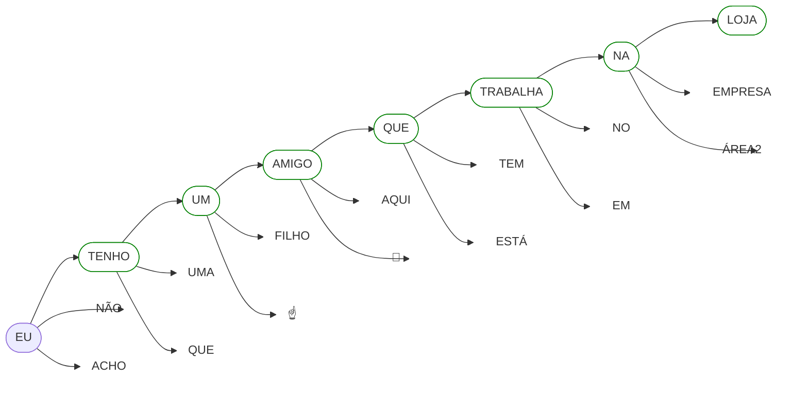
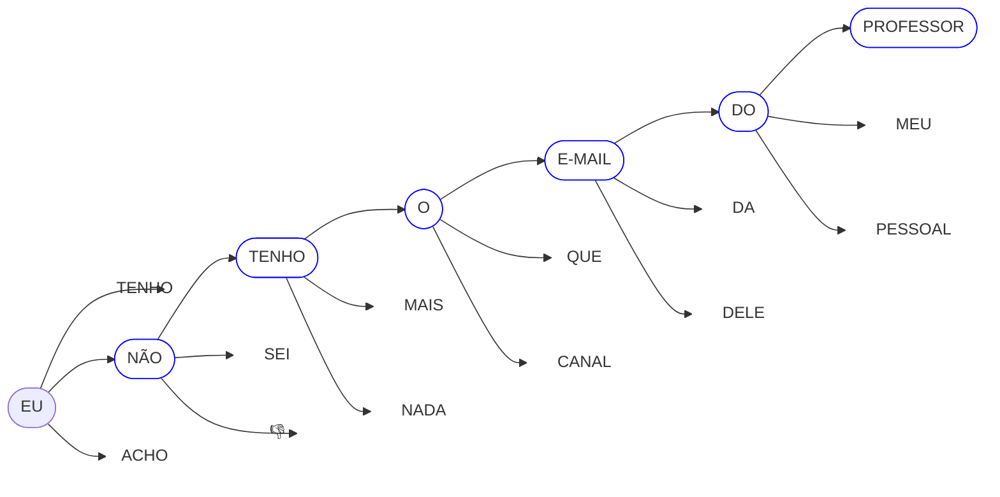
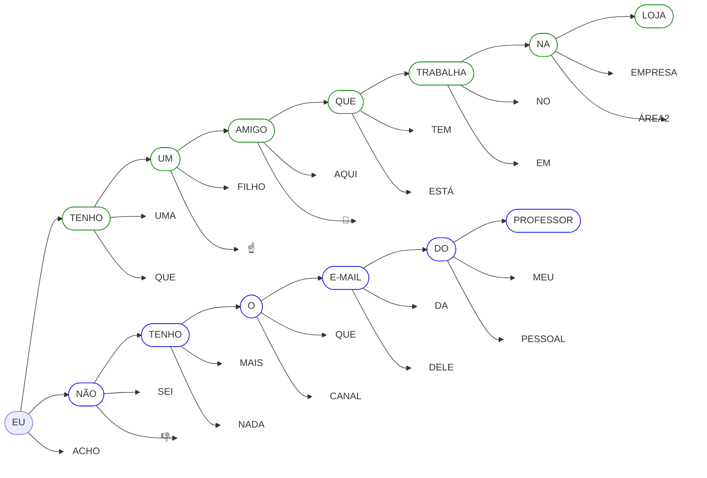

# Criatividade
Na seção "Desmistificando o ChatGPT", vimos que o ChatGPT é treinado com uma enorme quantidade de dados textuais para prever a próxima palavra em uma frase, considerando o contexto fornecido.

Para ajudar a compreender isso, retomemos a analogia apresentada no vídeo, que compara a geração de texto do ChatGPT ao funcionamento do recurso de autocompletar do celular.

### Primeiro exemplo

### Segundo exemplo
No segundo exemplo, observe como a frase muda drasticamente apenas por escolher a palavra "NÃO" ao invés de "TENHO".

Por fim, veja os dois exemplos lado a lado. Isso demonstra como uma simples escolha de palavras pode alterar significativamente o resultado final.

### Criatividade no ChatGPT
Agora, vamos explorar como essa lógica se aplica às respostas geradas pelo ChatGPT, mesmo quando a mesma pergunta é feita várias vezes.

O ChatGPT é projetado para responder perguntas prevendo qual seria a melhor sequência de palavras com base no que foi perguntado. No entanto, ele não segue sempre um caminho fixo. Em vez de escolher sempre a palavra mais "provável", o modelo considera várias opções possíveis para continuar o texto, cada uma com sua própria chance de ser escolhida. Isso significa que, mesmo para a mesma pergunta, o ChatGPT pode dar respostas diferentes.

Essa variabilidade acontece porque o modelo é projetado para não ser rígido. Ele explora diferentes combinações de palavras, mantendo a coerência com o contexto, mas abrindo espaço para "experimentar" outras maneiras de responder. 

Essa característica não é um erro, mas uma vantagem. Ao evitar respostas repetitivas, o ChatGPT se torna mais flexível, capaz de oferecer diferentes perspectivas ou formatos que se adaptem melhor às suas necessidades.

Se você precisar de respostas mais consistentes, pode incluir isso no seu pedido. Por exemplo, ao escrever "Responda sempre da forma mais breve possível" ou "Seja consistente nas respostas", o modelo buscará ajustar seu comportamento. Por outro lado, se quiser explorar diferentes abordagens, basta repetir a mesma pergunta ou reformulá-la ligeiramente para ver como o ChatGPT pode surpreendê-lo com novas ideias!

Entender que o ChatGPT não segue sempre o mesmo caminho ao responder ajuda a usar a ferramenta de forma mais eficaz, seja para explorar ideias ou obter informações.

