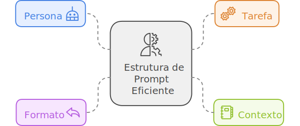
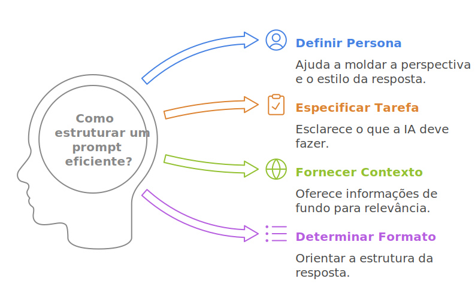
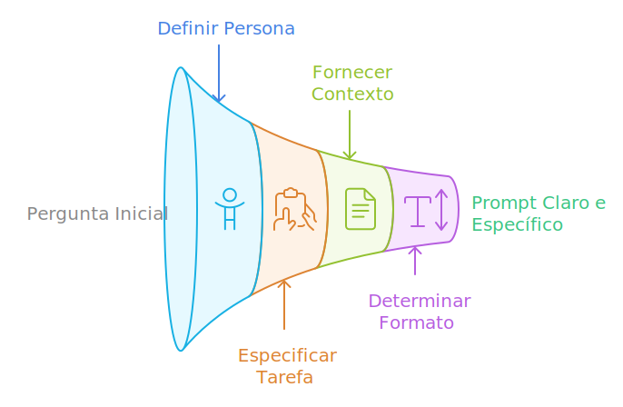
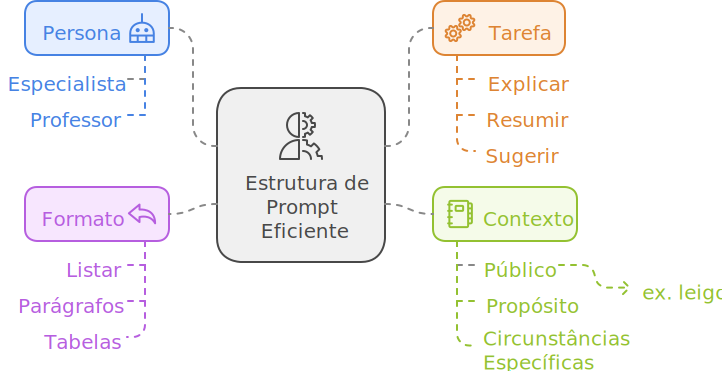

import ClassificarPrompt from '@site/src/components/ClassificarPrompt'
import IconPrompt from '@theme/Icon/Arrow';

# Estrutura do prompt
Já aconteceu de você fazer uma pergunta a alguém e receber uma resposta que não correspondia exatamente ao que você desejava saber? Com o ChatGPT, o mesmo pode acontecer. A maneira como você formula sua pergunta impacta diretamente a qualidade da resposta que você receberá.

Por isso, neste conteúdo, convido você a aprimorar junto comigo sua habilidade de estruturar *prompts* que gerem boas respostas.

## O que define um bom *prompt*?
Um bom *prompt* é claro, específico e direto. Ele fornece contexto suficiente para que o ChatGPT identifique exatamente o que você deseja.

Parece uma boa definição, certo? Mas como saber, na prática, se o *prompt* que você escreveu realmente é claro, específico e direto? Essa foi a dúvida que tive quando comecei a usar o ChatGPT, e ela me levou a encontrar uma estrutura que facilitou muito o início da minha jornada com o ChatGPT.

Agora, vou compartilhar essa estrutura com você.

## Estrutura de um *prompt* eficiente
Para obter respostas mais precisas e relevantes do ChatGPT, é recomendável estruturar seu *prompt* com alguns elementos-chave. Embora um *prompt* não precise conter todos esses elementos, a inclusão de alguns pode melhorar significativamente a qualidade da resposta. Os principais elementos a considerar são:

* <ClassificarPrompt tipo='persona'>Persona</ClassificarPrompt>: Define o "papel" que o ChatGPT deve assumir. Por exemplo, o ChatGPT pode atuar como especialista em tecnologia, professor, consultor de negócios, entre outros. Isso ajuda a moldar a perspectiva e o estilo da resposta. 
* <ClassificarPrompt tipo='tarefa'>Tarefa</ClassificarPrompt>: Especifica claramente o que você deseja que a IA faça. Exemplos incluem explicar um conceito, resumir um texto, fornecer sugestões ou propor soluções para um problema. Uma tarefa bem definida facilita a geração de uma resposta mais direta e útil. 
* <ClassificarPrompt tipo='contexto'>Contexto</ClassificarPrompt>:  Fornece informações adicionais que ajudam o ChatGPT a entender melhor o cenário ou o objetivo da pergunta. Isso pode incluir detalhes sobre o público-alvo, o propósito da resposta, ou quaisquer circunstâncias específicas relevantes. Um bom contexto melhora a precisão e a relevância da resposta. 
* <ClassificarPrompt tipo='formato'>Formato</ClassificarPrompt>: Define como a resposta deve ser estruturada, incluindo o tipo de apresentação, como lista, parágrafos explicativos, ou tabela comparativa, e também a quantidade ou tamanho desejado, como o número de palavras ou a extensão de cada seção. Especificar o formato ajuda a obter uma resposta que se encaixe melhor nas suas necessidades.

Lembre-se de que, quanto mais claro e específico for seu *prompt*, melhor será a interação com o ChatGPT. Embora um *prompt* não precise incluir todos os elementos mencionados, a presença deles pode melhorar significativamente a qualidade da resposta.

## Exemplos de *prompts*
Para facilitar a compreensão desse conceito, vamos analisar alguns exemplos. No conteúdo anterior, exploramos diversos *prompts*. Agora, você pode clicar em cada um deles para observar como a estrutura de um *prompt* "eficiente" se aplica na prática.

<ClassificarPrompt tipo='contexto'> Sou leigo em inteligência artificial</ClassificarPrompt> e gostaria de <ClassificarPrompt tipo='tarefa'>entender como o ChatGPT funciona</ClassificarPrompt>.

* <ClassificarPrompt tipo='persona'>Persona</ClassificarPrompt>: Não está claramente definido. O prompt não especifica um papel ou ponto de vista para o ChatGPT.
* <ClassificarPrompt tipo='tarefa'>Tarefa</ClassificarPrompt>: "Entender como o ChatGPT funciona." A tarefa é explicar o funcionamento do ChatGPT.
* <ClassificarPrompt tipo='contexto'>Contexto</ClassificarPrompt>: "Sou leigo em inteligência artificial." Isso fornece contexto sobre o nível de conhecimento do usuário.
* <ClassificarPrompt tipo='formato'>Formato</ClassificarPrompt>: Não está especificado. O formato da resposta (se deve ser uma explicação detalhada, resumo, etc.) não é foi definido.

<ClassificarPrompt tipo='contexto'>Sou leigo em inteligência artificial e tenho interesse em aprender</ClassificarPrompt> <ClassificarPrompt tipo='tarefa'>como o ChatGPT funciona. Pode explicar</ClassificarPrompt> de uma maneira que eu consiga entender, mesmo sem ter conhecimentos técnicos? <ClassificarPrompt tipo='formato'>Gostaria de uma explicação simples e concisa</ClassificarPrompt>.

* <ClassificarPrompt tipo='persona'>Persona</ClassificarPrompt>: Não está explicitamente definida, mas o trecho "Pode explicar de uma maneira que eu consiga entender, mesmo sem ter conhecimentos técnicos?" orienta a IA a adotar um tom acessível e simples, adequado para um leigo.
* <ClassificarPrompt tipo='tarefa'>Tarefa</ClassificarPrompt>: "Explicar como o ChatGPT funciona." A tarefa é fornecer uma explicação sobre o funcionamento do ChatGPT.
* <ClassificarPrompt tipo='contexto'>Contexto</ClassificarPrompt>: "Sou leigo em inteligência artificial e tenho interesse em aprender." Isso indica que o usuário não tem conhecimento técnico prévio e está interessado em aprender.
* <ClassificarPrompt tipo='formato'>Formato</ClassificarPrompt>: "Gostaria de uma explicação simples e concisa." Isso define que a resposta deve ser clara, direta e fácil de entender, sem detalhes técnicos complexos.

 
:::tip

O ChatGPT pode ajustar a extensão de suas respostas conforme solicitado, como ao limitar a resposta a um número específico de palavras. No entanto, a precisão pode variar, e o resultado nem sempre corresponderá exatamente ao número de palavras solicitado.

:::
 

<ClassificarPrompt tipo='tarefa'>Explique detalhadamente o que é um prompt no ChatGPT</ClassificarPrompt>, <ClassificarPrompt tipo='formato'>usando linguagem simples e exemplos práticos</ClassificarPrompt> <ClassificarPrompt tipo='contexto'>para facilitar a compreensão de iniciantes</ClassificarPrompt>.

* <ClassificarPrompt tipo='persona'>Persona</ClassificarPrompt>: Não está explicitamente definido no prompt. No entanto, implícito no pedido está o desejo de uma abordagem acessível e didática, voltada para iniciantes.
* <ClassificarPrompt tipo='tarefa'>Tarefa</ClassificarPrompt>: "Explique detalhadamente o que é um prompt no ChatGPT." A tarefa é fornecer uma explicação detalhada sobre o conceito de prompt no ChatGPT.
* <ClassificarPrompt tipo='contexto'>Contexto</ClassificarPrompt>: "Para facilitar a compreensão de iniciantes." Isso indica que o público-alvo é de iniciantes e precisa de uma explicação que seja fácil de entender.
* <ClassificarPrompt tipo='formato'>Formato</ClassificarPrompt>: "Usando linguagem simples e exemplos práticos." Isso define que a resposta deve ser clara, com uma linguagem simples e incluir exemplos práticos para facilitar a compreensão.

<ClassificarPrompt tipo='persona'>Você é um professor universitário de tecnologia</ClassificarPrompt> explicando <ClassificarPrompt tipo='contexto'>para uma turma de alunos iniciantes</ClassificarPrompt> o que é um 'prompt' no ChatGPT. <ClassificarPrompt tipo='tarefa'>Sua tarefa é explicar de forma simples e didática, contextualizando como o ChatGPT usa o prompt para gerar respostas baseadas nas instruções fornecidas</ClassificarPrompt>. <ClassificarPrompt tipo='formato'>Estruture a explicação em três parágrafos curtos e inclua um exemplo prático no final</ClassificarPrompt>.

* <ClassificarPrompt tipo='persona'>Persona</ClassificarPrompt>: "Você é um professor universitário de tecnologia." Isso define o papel da IA como um professor universitário, ajustando o tom e a abordagem da resposta para ser educacional e didática, adequada para uma turma de iniciantes.
* <ClassificarPrompt tipo='tarefa'>Tarefa</ClassificarPrompt>: "Sua tarefa é explicar de forma simples e didática, contextualizando como o ChatGPT usa o prompt para gerar respostas baseadas nas instruções fornecidas." A tarefa é fornecer uma explicação clara e educacional sobre como o ChatGPT utiliza o prompt para gerar respostas.
* <ClassificarPrompt tipo='contexto'>Contexto</ClassificarPrompt>: "Para uma turma de alunos iniciantes." Isso indica que o público-alvo são alunos iniciantes, o que ajuda a adaptar o nível de complexidade da explicação.
* <ClassificarPrompt tipo='formato'>Formato</ClassificarPrompt>: "Estruture a explicação em três parágrafos curtos e inclua um exemplo prático no final." Isso define que a resposta deve ser organizada em três parágrafos curtos e terminar com um exemplo prático para ilustrar o conceito.

<ClassificarPrompt tipo='tarefa'>Explique o conceito de LLM</ClassificarPrompt> <ClassificarPrompt tipo='formato'>usando uma metáfora</ClassificarPrompt> que facilite o <ClassificarPrompt tipo='contexto'>entendimento para leigos</ClassificarPrompt>.

* <ClassificarPrompt tipo='persona'>Persona</ClassificarPrompt>: Não está explicitamente definida no prompt. No entanto, o pedido sugere que a explicação deve ser acessível e voltada para leigos, o que implica um tom simples e fácil de entender.
* <ClassificarPrompt tipo='tarefa'>Tarefa</ClassificarPrompt>: "Explique o conceito de LLM." A tarefa é fornecer uma explicação sobre o conceito de Modelos de Linguagem de Grande Escala (LLM).
* <ClassificarPrompt tipo='contexto'>Contexto</ClassificarPrompt>: "Usando uma metáfora que facilite o entendimento para leigos." Isso indica que a explicação deve ser feita de uma forma que seja facilmente compreendida por pessoas sem conhecimento técnico prévio, utilizando uma metáfora para tornar o conceito mais claro.
* <ClassificarPrompt tipo='formato'>Formato</ClassificarPrompt>: Não está explicitamente definido no prompt. No entanto, a instrução para usar uma metáfora sugere que a resposta deve ser formulada de maneira descritiva e ilustrativa, com uma metáfora como elemento central.

<ClassificarPrompt tipo='persona'>Você é um pesquisador de IA</ClassificarPrompt> explicando <ClassificarPrompt tipo='contexto'>para uma equipe de líderes empresariais</ClassificarPrompt> o que são Large Language Models. Sua tarefa é <ClassificarPrompt tipo='tarefa'>detalhar o funcionamento desses modelos, mencionando os avanços que possibilitaram seu desenvolvimento e suas aplicações no mundo corporativo</ClassificarPrompt>. <ClassificarPrompt tipo='formato'>Estruture sua resposta em um formato de três parágrafos, cada um com foco em conceito, funcionamento e exemplos de uso prático</ClassificarPrompt>.

* <ClassificarPrompt tipo='persona'>Persona</ClassificarPrompt>: "Você é um pesquisador de IA." Isso define o papel da IA como um pesquisador especializado em Inteligência Artificial, o que implica uma abordagem técnica e informada.
* <ClassificarPrompt tipo='tarefa'>Tarefa</ClassificarPrompt>: "Detalhar o funcionamento desses modelos, mencionando os avanços que possibilitaram seu desenvolvimento e suas aplicações no mundo corporativo." A tarefa é explicar em detalhes como os Modelos de Linguagem de Grande Escala (LLMs) funcionam, os avanços tecnológicos que permitiram seu desenvolvimento e como são aplicados no ambiente corporativo.
* <ClassificarPrompt tipo='contexto'>Contexto</ClassificarPrompt>: "Para uma equipe de líderes empresariais." Isso indica que o público-alvo são líderes empresariais, o que sugere a necessidade de uma explicação que, embora técnica, deve ser relevante e aplicável ao mundo dos negócios.
* <ClassificarPrompt tipo='formato'>Formato</ClassificarPrompt>: "Estruture sua resposta em um formato de três parágrafos, cada um com foco em conceito, funcionamento e exemplos de uso prático." Isso define que a resposta deve ser organizada em três parágrafos distintos, abordando conceito, funcionamento e aplicações práticas dos LLMs.

## Colorindo os textos
Antes de encerrar esta seção, gostaria de fazer um comentário sobre os *prompts* e as classificações que apresentei. Identificar se um elemento do prompt pertence à Persona, Tarefa, Contexto ou Formato nem sempre é evidente. Portanto, se decidir adotar essa estruturação, tenha em mente que a classificação em si não deve ser o foco principal. O mais importante é fornecer informações claras e suficientes para que o ChatGPT compreenda sua solicitação e ofereça a melhor resposta possível. Pense nesses elementos como um *checklist* útil para avaliar se o seu *prompt* está bem estruturado.

## Parabéns
Neste conteúdo, você aprendeu uma estrutura útil para guiar a redação de seus próximos *prompts*. Ao seguir essa abordagem, você pode melhorar a clareza e a precisão das respostas geradas pelo ChatGPT. 

<guia01>
A partir de agora, você está promovido ao nível "Explorador do ChatGPT"!
</guia01>