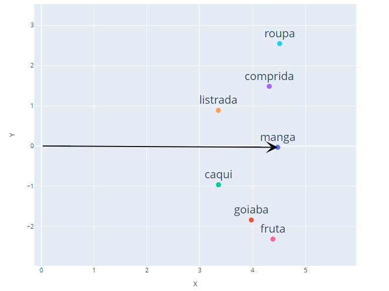
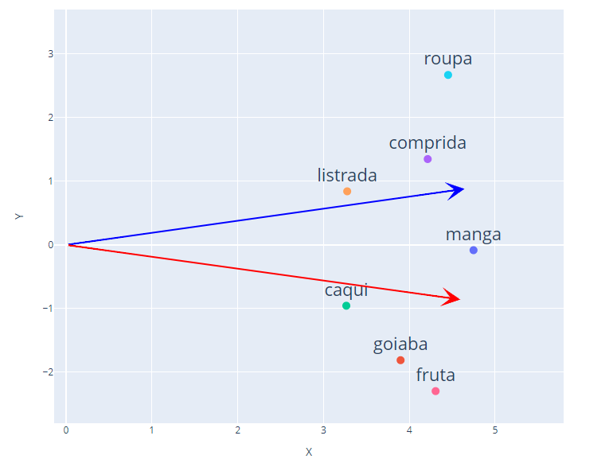

import LigaHighlight from '@site/src/components/gsap/highlight'

# Argh! Matemática!
<LigaHighlight />
Lembra daquela aula de física ou geometria, quando você aprendeu sobre vetores? Aquelas setas com direção e tamanho que, na época, você ou algum colega jurou nunca mais usar na vida? Pois é, aqui estamos de novo. Mas desta vez, eles podem ser a chave para te ajudar a criar *prompts* mais eficazes.

## O que são vetores?
Na escola, aprendemos que um vetor é uma grandeza com direção e magnitude. Em outras palavras, ele nos diz para onde e com qual intensidade algo está acontecendo. No mundo da matemática, podemos usar vetores para descrever movimentos. Imagine que você está andando em uma direção específica. Um vetor pode representar esse movimento, indicando não apenas o caminho que você escolheu, mas também a velocidade com que está se deslocando. No mundo da física, os vetores  ajudam a descrever forças, como o empurrão em uma porta ou a força da gravidade puxando você para baixo. Cada força tem uma direção — o sentido em que ela "puxa" ou "empurra" — e uma magnitude, que é o quão forte essa força é. 

Como expliquei na seção anterior:
>*... o ChatGPT foi exposto a uma vasta quantidade de textos, aprendendo padrões de uso das palavras em diferentes contextos. Esses padrões são representados como vetores contextuais em um espaço multidimensional, capturando relações semânticas. Cada vetor possui características de direção e magnitude, refletindo tanto as relações entre as palavras quanto sua importância relativa.*

## Tá! E daí?
Se as palavras são representadas como vetores, isso significa que podemos manipulá-las matematicamente — somando, subtraindo e até multiplicando esses vetores!

Por exemplo, veja a expressão abaixo:

$\overrightarrow{rei}-\overrightarrow{homem}+\overrightarrow{mulher} = $ &#32;?

No contexto dos modelos de linguagem, essa operação significa que o vetor correspondente à palavra "REI", *menos* o vetor correspondente à palavra "HOMEM", *mais* o vetor correspondente à palavra "MULHER", *resulta* em um vetor muito próximo da palavra "RAINHA". Quando fazemos "rei - homem",  a intenção é remover o componente masculino do conceito de "rei". Ao adicionar "mulher", o vetor resultante se aproxima de palavras relacionadas à realeza, mas com uma conotação feminina.

$\overrightarrow{rei}-\overrightarrow{homem}+\overrightarrow{mulher} \approx \overrightarrow{rainha}$

Isso demonstra como combinações vetoriais capturam significados e relações entre palavras. Outro exemplo:

$\overrightarrow{ator}-\overrightarrow{homem}+\overrightarrow{mulher} = $ &#32;?

O resultado? Você já deve imaginar: um vetor muito próximo à palavra "ATRIZ".

$\overrightarrow{ator}-\overrightarrow{homem}+\overrightarrow{mulher} \approx \overrightarrow{atriz}$

:::warning
Embora o exemplo da 'rainha' e da 'atriz' ajude a entender as relações entre palavras, o que acontece "debaixo do capô" do ChatGPT é muito mais complexo do que simples somas e subtrações de vetores. Se você quiser entender melhor essa dinâmica de combinar palavras, **[confira a conversa que tive com o ChatGPT](https://chatgpt.com/share/66f04f10-b428-8003-bc74-50fc2b898c95)** sobre o assunto.
:::
## Uma nova visão
No primeiro capítulo deste guia, pedi ao ChatGPT que explicasse o que é um prompt. Ele respondeu, entre outras coisas:

>*No contexto de IA e modelos de linguagem (como o ChatGPT), um "prompt" é o texto ou instrução fornecida ao modelo para gerar uma resposta. Por exemplo, se você perguntar "O que é um prompt?", a pergunta que você fez é o prompt que orienta a resposta gerada.*

Atente-se a palavra "orienta". Quando falamos em vetores, estamos nos referindo a direção e intensidade. Isso significa que cada palavra que você coloca no prompt ajuda a direcionar o ChatGPT sobre como responder ao que você deseja.

Vou usar uma palavra ambígua para demonstrar como podemos guiar o modelo de linguagem a interpretar diferentes contextos. A palavra "manga" é um ótimo exemplo, pois pode se referir tanto a uma parte de vestuário quanto a uma fruta. No gráfico abaixo, incluí seis palavras associadas a "manga" para ilustrar as relações semânticas dessas palavras no espaço vetorial. Embora o espaço vetorial real tenha muitas dimensões, neste gráfico utilizei apenas duas dimensões para simplificar a visualização. O vetor da palavra "manga" está destacado.

Se eu disser apenas "manga", sem mais contexto, o modelo de linguagem não saberá se estou falando da fruta ou da parte de uma roupa. A palavra sozinha não oferece um direcionamento claro. No entanto, se eu adicionar palavras como "roupa" (linha **azul**) ou "fruta" (linha **vermelha**), isso orienta o modelo, ajudando a reduzir a ambiguidade e apontando para o contexto desejado.

## Usando esta visão na prática
Agora que você entende que as palavras podem ser vistas como vetores em um espaço de significados, pode aplicar essa lógica para construir prompts mais eficazes. Pense nas relações entre as palavras e como elas podem alterar o contexto que você deseja explorar. 

Por exemplo, vamos imaginar que o seu objetivo é obter do ChatGPT informações históricas sobre a Revolução Francesa, com foco nas causas.

Vamos analisar um possível prompt
**Prompt:** *Explique as causas principais da Revolução Francesa, destacando fatores econômicos, sociais e políticos.*

### Contexto
As palavras "Revolução Francesa" formam um vetor que posiciona o modelo num contexto histórico específico, ativando uma região semântica relevante dentro do vasto conhecimento que o ChatGPT detém sobre história. Ao mencionar "causas principais", a geração da resposta é ajustado para focar na origem do evento, evitando detalhes menores que não atendem o nosso objetivo. Isso mantém a resposta focada e específica.

### Especificação das áreas
A utilização das palavras "econômicos", "sociais" e "políticos" orientam o modelo a buscar informações dentro de subespaços semânticos específicos. Esses termos funcionam como guias que ajudam a organizar a resposta, permitindo que o ChatGPT filtre o conhecimento histórico relevante de acordo com essas três dimensões. Isso significa que, ao solicitar que a explicação deve destacar estes três aspectos, você está ajudando o modelo a segmentar a resposta em áreas de interesse específicas, melhorando a qualidade da informação recebida.

