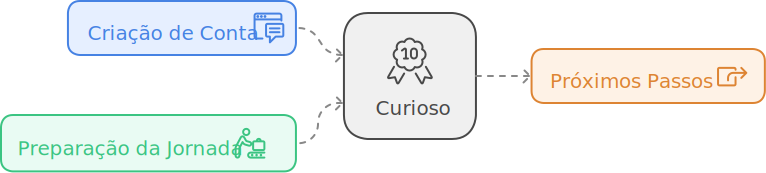

import Tabs from '@theme/Tabs';
import TabItem from '@theme/TabItem';
import styles from '@site/src/css/tabs.module.css';
import LigaHighlight from '@site/src/components/gsap/highlight'

# Curioso
<LigaHighlight />

Parabéns por iniciar sua jornada com o *Desmistificando o ChatGPT*! O simples fato de estar aqui já demonstra sua curiosidade e disposição para explorar o fascinante mundo da inteligência artificial. Este é o primeiro passo para transformar a maneira como você pensa e trabalha com o ChatGPT.  

Se você está lendo este guia, talvez já tenha ouvido falar sobre o ChatGPT ou até experimentado suas funcionalidades. Mas aqui, vamos além: este é um espaço para aprofundar seu conhecimento, aprender estratégias práticas e desbloquear todo o potencial dessa ferramenta poderosa.  

Agora, uma pergunta importante: você já criou sua conta no ChatGPT? Selecione uma das opções abaixo para que eu possa ajustar o conteúdo do guia às suas necessidades.

<Tabs>
  <TabItem value="nao" label="NÃO: não tenho login" attributes={{className: styles.opOrange}}>
    Antes de começarmos a explorar suas possibilidades, há uma missão inicial: **criar sua conta no ChatGPT**. Embora seja possível experimentar a ferramenta sem cadastro, criar uma conta permite acessar todos os recursos disponíveis e acompanhar seu progresso com mais facilidade. 

    [Basta acessar o site do ChatGPT](https://chatgpt.com/), clicar em "Cadastrar" e seguir os passos. Em segundops, você estará pronto para explorar!  

    Já criou sua conta? Excelente! Agora que tudo está pronto, ajuste sua cadeira, prepare a mente e respire fundo. Esta jornada promete transformar sua relação com a tecnologia, tornando-a uma aliada no trabalho, no estudo e na vida.
  </TabItem>

  <TabItem value="sim" label="SIM: já tenho um login" attributes={{className: styles.opGreen}}>
    Ótimo! Se você já tem uma conta no ChatGPT, está pronto para começar. Ajuste a cadeira, prepare a mente e respire fundo. Esta jornada promete transformar sua relação com a tecnologia, tornando-a sua maior aliada no trabalho, nos estudos e no dia a dia.
  </TabItem>
</Tabs>

Por ter dado este passo essencial, você já conquistou seu primeiro *badge*: **Curioso**! 🥳 Este título celebra sua iniciativa em começar algo novo e explorar o desconhecido.  

Vamos juntos nessa jornada de descobertas? Seu próximo destino é a "Iniciação", onde você começará a desvendar de forma prática e interativa os fundamentos do ChatGPT. 🚀  

