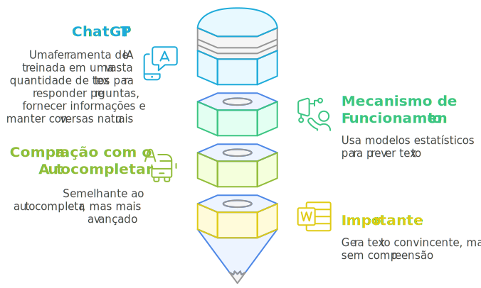

import ReactPlayer from 'react-player'

# Desmistificando o ChatGPT
Desmistificar algo significa retirar a camada de complexidade ou mistério que o torna difícil de entender. Quando falo em desmistificar o ChatGPT, meu objetivo é remover o mistério e a complexidade em torno da tecnologia. Assim, estou simplificando e esclarecendo seu funcionamento para que qualquer pessoa, independentemente do seu nível de conhecimento técnico, possa compreendê-lo e utilizá-lo com propriedade.

No vídeo abaixo, explico de forma simples como o ChatGPT funciona, com o objetivo de descomplicar essa tecnologia para que você possa utilizá-la com mais confiança e eficácia no seu dia a dia. Esse vídeo vai ajudar a transformar sua compreensão e a maneira como você interage com o ChatGPT.

:::note

Este vídeo também está presente no guia *Desmistificando a Inteligência Artificial*.

:::

<ReactPlayer url='https://youtu.be/Ik_Zbxrp-AI' width='100%' controls='true' />

 

