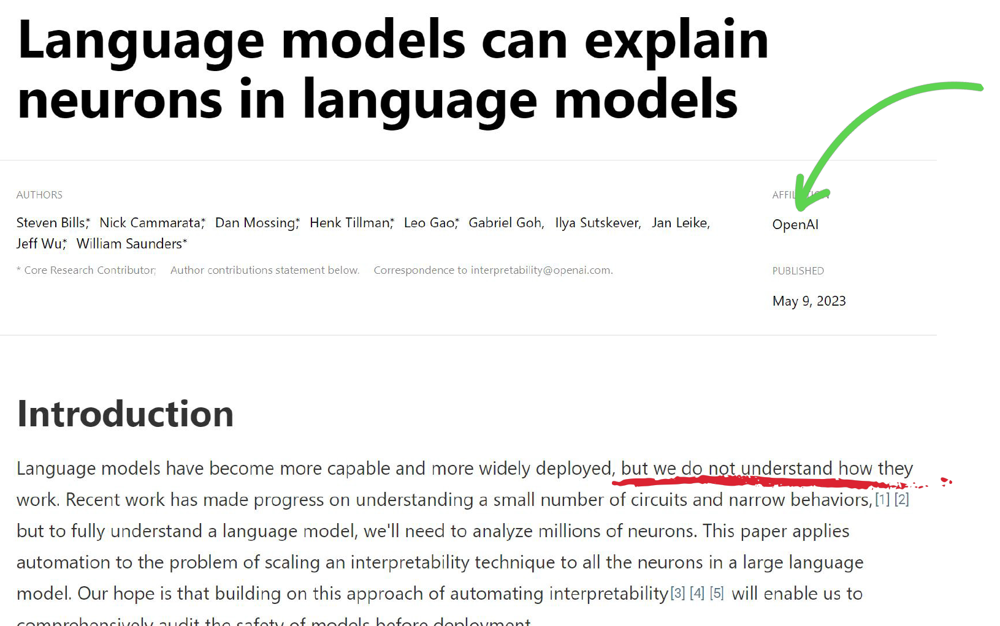

# Só sei que nada sei
Se você já assistiu a uma palestra ou explorou um guia de introdução à inteligência artificial, provavelmente já ouviu falar do artigo escrito por pesquisadores da OpenAI, a organização responsável pelo ChatGPT. Embora esse artigo não aborde diretamente o tema de prompts, ele traz uma reflexão impactante logo na introdução: *“Modelos de linguagem tornaram-se mais capazes e amplamente utilizados, mas ainda não compreendemos como eles funcionam.”*

)

Por isso neste guia [escrevi](../criacao/nova-visao):
>...*construir prompts pode ser uma combinação de arte, engenharia e tentativa e erro, com cada aspecto desempenhando um papel importante...*

Nesse contexto, construir prompts é uma mistura de arte, engenharia e tentativa e erro, em que cada aspecto desempenha um papel crucial no processo. A complexidade da rede neural por trás de um modelo de linguagem com mais de 175 bilhões de parâmetros ajustáveis torna praticamente impossível, pelo menos até hoje, compreender completamente as relações armazenadas nessa estrutura massiva.

Por isso, o estudo e a experimentação sobre como criar os melhores prompts têm se tornado uma prática comum. Algumas abordagens, inclusive, chegam a ser bastante criativas — como oferecer uma "gorjeta" no prompt ou até incluir uma ameaça, na tentativa de obter melhores respostas ([veja aqui, em inglês](https://minimaxir.com/2024/02/chatgpt-tips-analysis/)). Embora essas experiências sejam anedóticas, outras investigações sistemáticas analisam o impacto do uso das palavras nas respostas dos modelos, como o estudo que analisou the Influence of Prompt Politeness on LLM Performance. Isso mesmo: incluir um "por favor" ou uma expressão educada no prompt pode melhorar a qualidade da resposta (veja aqui, em inglês). O estudo observed that impolite prompts often result in poor performance, but overly polite language does not guarantee better outcomes. 

Uma possibilidade para em alguns cenários a polidez do prompt enfluenciar a resposta pode estar  ao textos usados no treinamento onde a linguagem formal e respeitosa apareça com mais frequência vinculada a interações de alta qualidade. Mas, como a frase contida na introdução do artigo da OpenIA *"...ainda não compreendemos como eles funcionam."*

Mas o meu objetivo maior com este texto é outro. Quando usamos o ChatGPT, a experiência é tão natural e interativa que muitas vezes nos esquecemos de uma verdade fundamental: não estamos conversando com uma pessoa, mas sim com um modelo de linguagem avançado. Essa fluidez faz com que muitos usuários escrevam como se estivessem dialogando com um amigo — e isso não está errado. Inclusive, já discutimos essa abordagem na estratégia "Adote o Papel de Mentor".

## Para um bom entendedor...
Mas para se tornar um mestre no uso do ChatGPT, é essencial compreender como as suas respostas são sensíveis as palavras que utilizamos no prompt. Assim como a "polidez" em alguns casos possa gerar uma resposta um pouco melhor. Por outro lado é possível obter respostas muito boas usando apenas as palavras mais relevantes.Palavras-chave bem escolhidas podem ser suficientes para que o modelo entenda e atenda às suas necessidades. Entender essa dinâmica é fundamental para que você consiga chegar a maestria no uso do ChatGPT.

## O ChatGPT e as Palavras-Chave  
Embora frases completas e detalhadas sejam úteis, o ChatGPT também responde muito bem a prompts curtos baseados em palavras-chave. Isso acontece porque ele processa o texto com base nos padrões e significados que essas palavras carregam. Por exemplo, ao invés de digitar:  
*"Poderia me fornecer algumas dicas para cuidar de plantas dentro de casa?"*,  
você pode simplesmente escrever:  
*"Dicas cuidar plantas dentro casa"*.  

Ambos os formatos funcionarão, mas isso ilustra como o mais importante nos prompts são as palavras que levam o modelo a chegar na resposta desejada como comentei na seção [arte ou engenharia](../criacao/nova-visao#o-detetive-chatgpt).  

## Simplifique e Experimente  
Como um "mestre do GPT", seu objetivo é descobrir como estruturar seus prompts da maneira mais eficiente. Aqui estão algumas práticas que você pode adotar:  
- **Use palavras-chave:** Perfeito para solicitações diretas ou amplas.  
- **Inclua contexto quando necessário:** Se o pedido é específico, forneça detalhes relevantes.  
- **Teste diferentes formatos:** Às vezes, uma reformulação simples transforma uma resposta.  

Por exemplo:  
1. *Resumo relatório vendas principais tendências*.  
1. *Dicas otimização SEO blog artigos*.  
1. *Etapas planejamento projeto exemplo prático.*
1. *Modelo e-mail profissional apresentação empresa.*

## Não é sobre "etiqueta", é sobre eficácia  
No dia a dia você pode ser "econômico" na sua interação com o ChatGPT. O seu prompt pode se ater ao essencial. Mas claro, se escrever frases completas ajuda você a estruturar melhor seus pensamentos, pode continuar usando. Apenas lembre-se: o próprio chatgpt vai analisar o seu prompt e considerar o que ele identifica como mais relevante, e que por sinal, consegue fazer isso muito bem. Eu mesmo me pego usando palavras como "obrigado" ou "por favor" nos meus prompts. Mas um prompt focado em palavras chaves pode ajudar deixar claro para o modelo o que realmente interessa para você.

Seja qual for a abordagem, o mais importante é garantir que o modelo tenha informações suficientes para entender o que você quer.  

