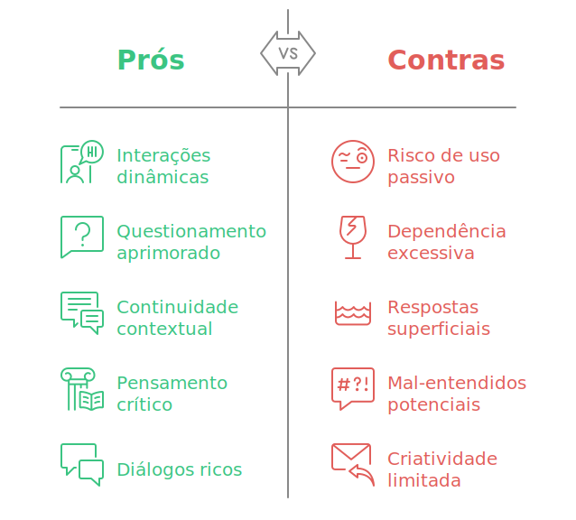

# Uso consciente
Para alcançar o nível "Mestre" no uso do ChatGPT, é fundamental equilibrar os benefícios dessa ferramenta com uma abordagem consciente, explorando seus limites e oportunidades, sem se tornar dependente dela. Nesta seção, exploraremos os prós, os contras e as melhores práticas para um uso responsável.

## **Prós**: Oportunidades de Enriquecimento
1. **Pensamento crítico**: Quando usado estrategicamente, ajuda a aprofundar análises e a desafiar pressupostos.
1. **Diálogos ricos**: O ChatGPT pode gerar interações dinâmicas, estimulando ideias e expandindo perspectivas.
1. **Criatividade explorada**: A ferramenta pode ser uma aliada na geração de ideias inovadoras e na resolução criativa de problemas.

## **Contras**: Riscos a Serem Gerenciados
1. **Risco de uso passivo**: Evite aceitar as respostas sem questioná-las; o aprendizado real ocorre no processo de refinar perguntas e validar resultados.
1. **Dependência excessiva**: Usar o ChatGPT como única fonte de criatividade ou solução pode limitar seu desenvolvimento pessoal.
1. **Respostas superficiais**: Confie, mas verifique. As respostas podem parecer completas, mas às vezes carecem de profundidade ou precisão.
1. **Mal-entendidos potenciais**: Informações geradas podem ser interpretadas erroneamente, especialmente sem validação adequada.
1. **Criatividade limitada**: Embora útil, a criatividade do ChatGPT se baseia em padrões existentes e não substitui a originalidade humana.

## **Melhores Práticas para o Uso Consciente**
1. **Interações dinâmicas**: Conduza conversas exploratórias, ajustando as perguntas para refinar o entendimento.
2. **Questionamento aprimorado**: Pratique a arte de perguntar melhor. Formule questões mais detalhadas para obter respostas mais relevantes.
3. **Continuidade contextual**: Lembre-se de fornecer contexto ao ChatGPT e manter o controle sobre o direcionamento das interações.

Usar o ChatGPT de forma consciente é mais do que simplesmente gerar respostas; é sobre desenvolver habilidades de pensamento crítico, aproveitar a tecnologia como uma extensão para explorar ideias e economizar tempo, e, acima de tudo, lembrar que você está no controle, direcionando e moldando seu uso para atender às suas necessidades, e não o contrário.

