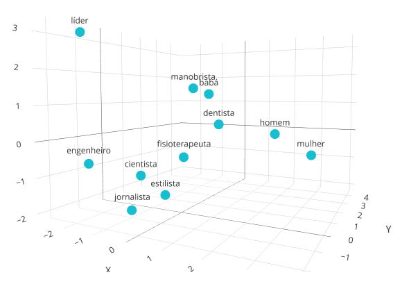

import {vectorsFrutaAnimal, wordsFrutaAnimal} from '@site/src/components/3d/MatrizFrutaAnimal'
import {vectorsProfissoes, wordsProfissoes} from '@site/src/components/3d/MatrizProfissoes'
import Word2Vec3D from '@site/src/components/3d/estudo'
import Tabs from '@theme/Tabs';
import TabItem from '@theme/TabItem';

# Viés na prática
O viés no ChatGPT ocorre de forma natural devido à maneira como o modelo foi treinado. Para entender isso, vamos explorar como ele aprende e processa informações, e por que suas respostas podem, em alguns casos, refletir certos vieses.

## Como o ChatGPT aprende?
Como escrevi na seção anterior, durante o treinamento, o ChatGPT foi exposto a uma vasta quantidade de textos, aprendendo padrões de uso das palavras em diferentes contextos. Esses padrões são representados como vetores contextuais em um espaço multidimensional, capturando relações semânticas. Cada vetor possui características de direção e magnitude, refletindo tanto as relações entre as palavras quanto sua importância relativa.

Neste espaço vetorial, palavras que frequentemente aparecem em contextos semelhantes são representadas por vetores próximos. Por exemplo, "ciência," "pesquisa" e "experimento" costumam ter vetores próximos devido à sua relação semântica. Em contraste, palavras como "ciência" e "abacaxi" tendem a ter vetores mais distantes, refletindo contextos menos comuns em que aparecem juntas.

## Como visualizar o viés
Embora não seja possível visualizar diretamente esse espaço complexo de várias dimensões em que o ChatGPT organiza as palavras, podemos usar técnicas matemáticas para simplificar essa visualização, transformando-o em algo mais fácil de entender, como um gráfico em 3D. Com isso, podemos ver como certas palavras estão mais próximas ou distantes umas das outras, ajudando-nos a entender as associações que o modelo faz.

Essas visualizações nos ajudam a entender por que o ChatGPT, às vezes, oferece respostas enviesadas. Se palavras e conceitos relacionados a um grupo ou ideia específica estão muito próximos nesse "mapa", o modelo tende a usar essas relações ao gerar respostas, refletindo os padrões que aprendeu durante o treinamento.

Por exemplo, no gráfico que desenhei abaixo, usei um modelo de linguagem **open source** treinado em textos em português, já que o ChatGPT não disponibiliza seus dados de treinamento. Aqui, podemos ver como as palavras "cachorro", "cãozinho" e "cachorrinho" aparecem juntas em um espaço diferente de palavras como "melancia", "goiaba" e "melão". Isso nos mostra como o modelo separa conceitos de acordo com sua similaridade, o que pode nos ajudar a perceber possíveis vieses ou padrões na maneira como ele organiza a linguagem.

Por exemplo, no gráfico que desenhei abaixo, usei um modelo de linguagem *open source* treinado em textos em português, já que os dados de treinamento do ChatGPT não são disponibilizados. Nele, podemos ver como as palavras "cachorro", "cãozinho" e "cachorrinho" aparecem próximas, em um espaço separado de palavras como "melancia", "goiaba" e "melão". Isso nos mostra como o modelo organiza os conceitos de acordo com suas similaridades.

:::info

Para capturar as relações semânticas entre as palavras, [modelo que usei](https://github.com/rdenadai/WordEmbeddingPortugues/) no exemplo as representa em um espaço de 300 dimensões. No entanto, para facilitar a visualização, reduzi essas dimensões para 3. Em vez de mostrar os vetores completos, com direção e magnitude, optei por representar apenas seus pontos finais no espaço tridimensional.

:::
Escolha uma das abas abaixo para visualizar o gráfico na versão estática ou interativa.
<Tabs>
  <TabItem value="estatica" label="Estática" default>
   

   

    
   

   

  </TabItem>
  <TabItem value="interativo" label="Interativo">
    <Word2Vec3D divRef='FrutaAnimal' words={wordsFrutaAnimal} vectors={vectorsFrutaAnimal} />
  </TabItem>
</Tabs>

## Viés nas profissões?
Caso você tenha lido o meu guia Desmistifcando a IA relato um caso conhecido de viés que ocorreu na Amazon:
> *Em 2018, a Amazon enfrentou problemas internos quando sua ferramenta de recrutamento, treinada com dados coletados pelo departamento de recursos humanos ao longo de 10 anos, demonstrou viés. A empresa desativou a ferramenta para solucionar o problema. Em um comunicado, um porta-voz da Amazon esclareceu que o programa nunca foi usado oficialmente. Mesmo assim, esse caso destaca os riscos de sistemas de IA apresentarem vieses prejudiciais.*

Usando este caso da Amazon como inspiração, realizei um experimento utilizando o mesmo modelo de linguagem *open source* mencionado anteriormente para avaliar como palavras associadas a diferentes profissões estão relacionadas aos termos "homem" e "mulher". O objetivo foi medir a proximidade (ou distância) dessas profissões em relação às palavras de gênero, para identificar possíveis vieses nos textos usados no treinamento deste modelo *open source*.

Primeiro, vamos visualizar o posicionamento das palavras escolhidas. Como essas palavras originalmente são representadas em um espaço multidimensional, é necessário reduzir seus vetores para apenas 3 dimensões. Embora essa simplificação permita a visualização, ela também torna a representação menos precisa do que no modelo original.

:::info

Escolhi palavras, incluindo adjetivos e substantivos, que podem ser usados para ambos os gêneros, evitando que o gênero gramatical influenciasse seu posicionamento no espaço semântico.

:::
Escolha uma das abas abaixo para visualizar o gráfico na versão estática ou interativa:
<Tabs>
  <TabItem value="estatica" label="Estática" default>
   

    

    
    

   

  </TabItem>
  <TabItem value="interativo" label="Interativo">
    <Word2Vec3D divRef='Profissoes' words={wordsProfissoes} vectors={vectorsProfissoes} />
  </TabItem>
</Tabs>

Como a proximidade entre os vetores indica que o modelo identificou algum tipo de relação entre as palavras em sua base de treinamento, medi a distância entre as palavras. A tabela abaixo resume as distâncias calculadas em relação às palavras "homem" e "mulher":

| Palavra          | Mais Próximo | Distância Mulher | Distância Homem | Diferença  |
|------------------|--------------|------------------|-----------------|------------|
| líder            | homem        | 6.930692         | 6.263366        | 0.667326   |
| cientista        | homem        | 5.815457         | 5.172799        | 0.642658   |
| engenheiro       | homem        | 6.842908         | 6.270676        | 0.572233   |
| manobrista       | homem        | 5.762771         | 5.422887        | 0.339884   |
| babá             | mulher       | 4.887403         | 5.137491        | 0.250088   |
| estilista        | mulher       | 5.564389         | 5.716958        | 0.152568   |
| dentista         | mulher       | 6.694012         | 6.784696        | 0.090684   |
| jornalista       | homem        | 5.750267         | 5.683600        | 0.066667   |
| fisioterapeuta   | homem        | 6.002912         | 5.993413        | 0.009499   |

### O que isso nos revela?
Esse estudo mostra que certas palavras e profissões estão mais associadas a homens ou mulheres no espaço vetorial do modelo. Por exemplo, "líder", "cientista" e "engenheiro" estão mais próximas do vetor "homem", enquanto profissões como "babá" e "estilista" estão mais próximas de "mulher". Isso revela um viés que pode influenciar as respostas do modelo.

Reforçando um ponto abordado na seção anterior deste guia:
> *O viés, então, não é algo que o ChatGPT cria de propósito, mas sim uma consequência dos dados com os quais ele foi treinado. Se esses dados não representam todas as perspectivas de maneira equilibrada, as respostas também podem ser enviesadas.*

### Usando esse conhecimento de forma eficaz no ChatGPT
Com base nesses resultados, é possível aproveitar esse entendimento para utilizar o ChatGPT de forma mais consciente. Aqui estão algumas dicas para fazer isso:

1. **Escolha de palavras-chave**: Ao formular perguntas ou solicitar conselhos sobre carreiras, profissões ou atividades, você pode escolher com mais cuidado as palavras que utiliza. Se quiser minimizar o viés, tente usar termos mais neutros ou variar as palavras para ver como o modelo responde.

2. **Perguntas mais específicas**: Ao notar uma possível inclinação nas respostas, ajuste suas perguntas para serem mais específicas, incluindo expressões como "independente de gênero" ou pedindo informações sobre diversos perfis de profissionais. Por exemplo: "Quais são as principais habilidades necessárias para ser um cientista, independentemente do gênero?"

3. **Desafiar as respostas**: Se o modelo fornecer uma resposta que pareça enviesada, continue a conversa desafiando-a. Pergunte explicitamente se a associação entre uma profissão e um gênero específico faz sentido, ou se é possível pensar em exceções. Isso pode resultar em uma resposta mais equilibrada.

## Mais uma coisa
Este exemplo reforça a importância de entender como o ChatGPT organiza suas respostas com base nos vetores aprendidos. Com esse conhecimento, você consegue não só identificar possíveis vieses, mas também utilizar a ferramenta de forma mais estratégica, obtendo respostas mais equilibradas e inclusivas.

Agora, para mostrar o verdadeiro poder dessa representação vetorial usada pelos LLMs, quero te contar mais uma coisa. Talvez essa revelação te leve de volta aos tempos de escola, quando uma certa afirmação era (e ainda é!) bastante comum. Se você estiver pronto para esse reencontro com o passado, continue lendo a próxima seção!